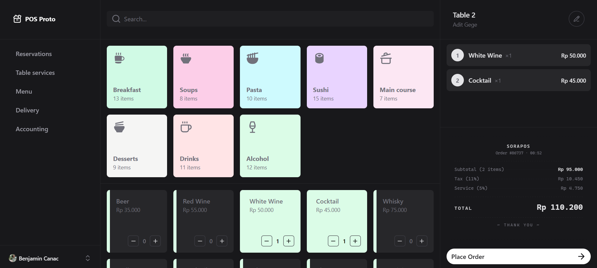

# POS Proto

A prototype Point-of-Sale interface for restaurants and cafés. Browse a categorized menu, build an order from any table, and watch the receipt total tally in real time.



## Features

- **Three-pane layout** — collapsible navigation, product browser, and order summary side-by-side on desktop, fully responsive down to mobile
- **Category-driven menu** — 8 categories (Breakfast, Soups, Pasta, Sushi, Main course, Desserts, Drinks, Alcohol) with color-coded cards and instant filtering
- **Inline quantity controls** — increment/decrement directly on each menu card, no modal interruptions
- **Live order summary** — subtotal, 11% tax, 5% service charge, and total recompute on every change
- **Swipe-to-delete** — drag a line item right to remove it, with spring-physics feedback powered by [Motion](https://motion.dev/)
- **Receipt-styled footer** — torn-paper edges, dashed dividers, and dotted leaders for that thermal-printer look
- **IDR currency formatting** via `Intl.NumberFormat`
- **Dark mode** — switchable from the user menu, persisted via `@vueuse/core`

## Tech stack

- **Vue 3.5** with `<script setup>` and the Composition API
- **TypeScript 6**
- **Vite 8** for dev server and bundling
- **Nuxt UI 4** (`@nuxt/ui/vue-plugin`) for components, theming, and icons
- **Tailwind CSS 4** for styling
- **motion-v** for spring animations and `AnimatePresence` exit transitions
- **vue-router 4** for routing
- **@vueuse/core** for `useMediaQuery` and `useColorMode`
- **@antfu/eslint-config** for linting and formatting

## Getting started

```bash
pnpm install
pnpm dev
```

The app runs on the default Vite port (5173).

## Scripts

| Command | What it does |
|---|---|
| `pnpm dev` | Start the Vite dev server |
| `pnpm build` | Type-check with `vue-tsc` and produce a production build |
| `pnpm preview` | Preview the production build locally |
| `pnpm lint` | Run ESLint |
| `pnpm lint:fix` | Run ESLint with `--fix` |

## Project layout

```
src/
├── App.vue                 # Root layout with <RouterView />
├── main.ts                 # App bootstrap, router, Nuxt UI plugin
├── pages/
│   └── Index.vue           # The single POS screen
├── components/
│   ├── AppSidebar.vue      # Left nav (Reservations, Table services, etc.)
│   ├── ProductBrowser.vue  # Search + category grid + menu grid
│   ├── ButtonCategory.vue  # Category tile
│   ├── CardMenu.vue        # Menu item card with qty stepper
│   ├── OrderSidebar.vue    # Right pane: line items + receipt + CTA
│   └── Logo.vue
├── data/
│   ├── types.ts            # Product / CategoryButton / CategoryId types
│   ├── categoryMockData.ts # 8 hard-coded categories
│   └── productMockData.ts  # ~85 hard-coded products
└── utils/
    └── format.ts           # formatPrice() — IDR formatter
```

## Notes

- Data is mocked in `src/data/`. There is no backend; selected items live in a local `reactive` object on `Index.vue`.
- Path alias `@` resolves to `src/` (configured in `vite.config.ts`).
- Theme uses `rose` as primary and `zinc` as neutral.
# PosProto
